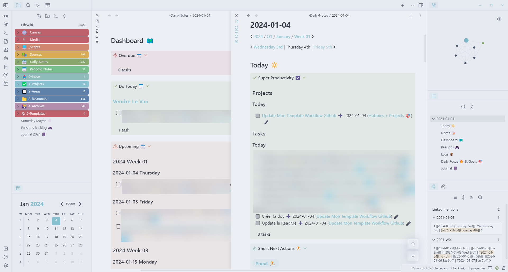

# Obsidian workflow
### v1.0.0
An <a href="https://obsidian.md/">Obsidian</a> vault template from a Workflow with
Tasks and Project Management, Journaling, Media Tracking, Offline Read-it-later
and Bookmark Management, Note-taking and Note-sharing on your own website.

### [Download](#2-download)
#### View this repository on [GitHub][03], [Codeberg][01], or [Gitea][02].
[01]: https://codeberg.org/portellam/Obsidian-workflow
[02]: https://gitea.com/portellam/Obsidian-workflow
##

## Table of Contents
- [1. Introduction](#1-introduction)
- [2. Download](#2-download)
- [3. Usage](#3-usage)
- [4. Features](#4-features)
- [5. Documentation](#5-documentation)
- [6. Contac](#6-contact)
- [7. Support](#7-support)

## Contents
### 1. Introduction

As promised to quite a few people on different places, here is the author's
Obsidian workflow template. It has many cool features, of which solve issues
people have:

1. Daily and Periodic notes. Tasks and project management with journaling,
workout logging and media tracking.

2. Read-it-later with automated conversion to markdown and import inside your
vault. Meaning all your past knowledge is inside Obsidian, available with a
simple search alongside your notes.

3. Fast and simple one click upload obsidian publish alternative.

But there’s plenty more. It took the author some time here and there during the
past year (2021) to come up with this setup. And don’t worry, it is
**easy to use** despite its awfully long name.

Obviously, it is merely just a starting point, with Obsidian you can (and you
always should) do something that works well for **you**. And that means creating
your **own** setup. But that doesn’t forbid you from using this one as a
starting-point.

### 2. Download
- Download the Latest Release:&ensp;[GitHub][12] or [Codeberg][11].

- Download the `.zip` file:
    1. Viewing from the top of the repository's (current) webpage, click the
        drop-down icon:
        - `···` on Codeberg.
        - `<> Code ` on GitHub.
    2. Click `Download ZIP` and save.
    3. Open the `.zip` file, then extract its contents.

- Clone the repository:
    1. Open a Command Line Interface (CLI) or Terminal.
        - Open a console emulator (for Debian systems: Konsole).
        - **Linux only:** Open an existing console: press `CTRL` + `ALT` + `F2`,
        `F3`, `F4`, `F5`, or `F6`.
            - **To return to the desktop,** press `CTRL` + `ALT` + `F7`.
            - `F1` is reserved for debug output of the Linux kernel.
            - `F7` is reserved for video output of the desktop environment.
            - `F8` and above are unused.
    2. Change your directory to your home folder or anywhere safe:
        - `cd ~`
    3. Clone the repository:
        - `git clone https://www.github.com/portellam/Obsidian-workflow`

[11]: https://codeberg.org/portellam/Obsidian-workflow/releases/latest
[12]: https://gitea.com/portellam/Obsidian-workflow/releases/latest

### 3. Usage
In *Obsidian*, open the root folder

### 4. Features
- 🎨 Beautiful design using
[AnuPpuccin: Personal theme for Obsidian](https://github.com/AnubisNekhet/anuppuccin).

- 🗃️ [P.A.R.A](https://fortelabs.com/blog/para/) folder organisation based on
file actionability.

- ✅ [GTD](https://gettingthingsdone.com/) task management on par with a
[full Todoist setup](https://todoist.com/fr/productivity-methods/getting-things-done),
but with a simple and natural way of **writing tasks alongside notes**.
You also get to keep your project tasks, notes and files archives when you
finish a project, allowing you to access these informations in the future.

- 📅 Daily notes for task management, periodic notes for projects management
week, month, quarter and year).

- 📓 Journal section for each daily and periodic notes to write about anything
that happened during a certain period of time.

- 🎮 Media backlog Kanban board for tracking books, shows, movies or video games
backlog, consuming media at the right pace, and archiving what you do. All
without proprietary online services that hold you data.

- 🔗 Read-it-later / bookmark manager with automated markdown conversion for
offline storage inside your vault using [Omnivore app](https://omnivore.app/).
That means easy search for knowledge inside your vault across sources and
personal notes.

- 📝 [Zettelkasten note-taking](https://everlaab.com/methode-zettelkasten-comment-prendre-des-notes-utiles/)
on a flat structure inside `03 - Resources` folder.

    1. 📎 Import sources automatically using
	[obsidian-omnivore](https://github.com/omnivore-app/obsidian-omnivore)
	plugin for an automatic markdown conversion of a webpage or document online
	or manually from a file or using
	[markdownload](https://github.com/deathau/markdownload).
	
    2. Highlight and take reference notes using
	[Omnivore app](https://omnivore.app/) or directly inside your vault using a
	simple markdown file.
	
    3. Write literature notes to summarise the source informations.
	
    4. Write permanent notes from key concepts directly inside literature notes
	using wiki-links.
	
- 🌐 One click upload of file and attachments to a [Hugo](https://gohugo.io/)
website hosted on [Github Pages](https://pages.github.com/) thanks to
[obsidian-github-publisher](https://github.com/ObsidianPublisher/obsidian-github-publisher)
plugin.

### 5. Documentation
The original author's documentation is available [here](https://mathisgauthey.github.io/obsidian-workflow-template-docs/).

If you want to modify it, feel free to help in the [docs repository](https://github.com/portellam/Obsidian-workflow-docs).

### 6. Contact
Do you need help? Please visit the [Issues][21] page.

[21]: https://github.com/portellam/template/issues

### 7. Support
Word from the [original author](https://github.com/mathisgauthey/obsidian-workflow-template):

Support the original author:

#

#### Click [here](#template) to return to the top of this document.